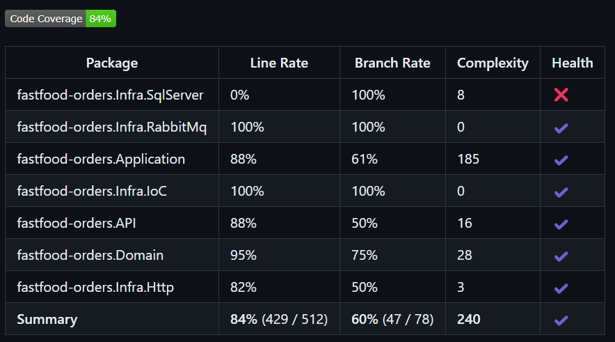

# fastfood-orders

O repositorio fastfood-orders tem por objetivo disponibilizar os CRUDs para gerenciamento dos pedidos do fastfood, utilizando o SQLServer para persistência dos dados.
O início da jornada do cliente partirá daqui, onde é possível gerar o pedido.

## Github Actions
### Necessário
* Configurar no GitHub as *Secrets and variables*, entrando em *Actions* e adicionando na parte *Repository secrets* a seguinte:
  * AWS_ACCESS_KEY_ID 
  * AWS_SECRET_ACCESS_KEY
* Rodar a primeira run no [Repositório Terraform](https://github.com/pos-4soat/fastfood-infra), para criação do ECR e RDS do SQL

Esse projeto tem um workflow de subir a imagem do projeto ao ECR ao realizar o merge para a branch main.

Fluxo:
* RUN 1 do terraform
* Workflow do [Produto](https://github.com/pos-4soat/fastfood-products?tab=readme-ov-file)
* Atualizar secret com uri do loadbalancer de produtos
* Workflow para realizar o deploy da imagem no ECR

## Execução do projeto
Para executar o projeto é fácil, basta apenas definir os valores paras as variáveis de ambiente dele, que se encontram no launchsettings.json da API.
Após isso, basta executar o projeto da forma que preferir, nós utilizamos o Docker para isso.

### Variáveis de ambiente
Todas as variáveis de ambiente do projeto visam fazer integração com algum serviço da AWS. Explicaremos a finalidade de cada uma:

- SqlServerConnection: Conexão com banco de dados SQL. Recurso gerado no RUN 1 do terraform, através do RDS;

## Arquitetura do projeto
A seguinte arquitetura foi utilizada para o projeto:


Como decidimos utilizar a AWS como plataforma nuvem, utilizamos o ECR para armazenar e gerenciar a imagem do contêiner da aplicação, EKS para implantar e gerenciar a aplicação em um cluster Kubernetes, HPA para escalar horizontalmente a aplicação . 
Para gerenciar melhor os dados do pedido correlacionados com produto e produção, optamos por utilizar o SQL Server. Por ser um banco de dados relacional, pensamos em utilizá-lo para armazenar os dados dos pedidos criando relacionamentos com produto e produção. Nessa solução, apenas as tabelas Pedidos e ItensPedidos foram utilizados.
Esse projeto possui uma conexão com o projeto de produtos, para busca de dados, exemplo valor, para cada produto adicionado na lista da criação do pedido.

## Endpoints

Esse projeto possui 6 endpoints:

POST /order -> Responsável por criar um pedido com o seguinte json:
```
{
  "orderedItems": [
    {
      "productId": "1",
      "quantity": "2"
    }
  ],
  "userId": "42318970858"
}
```

GET /order/{orderId} -> Responsável por retornar os dados do pedido.

PATCH /order -> Responsável por atualizar o status de um pedido com o seguinte json:
```
{
  "id": "1",
  "status": 2
}
```

GET /order/status/{status} -> Responsável por retornar todos os pedidos com base no status especificado.

GET /order -> Responsável por retornar todos os pedidos.

GET /order/pending -> Responsável por retornar todos os pedidos pendentes.

## Cobertura de código
Fluxo de cobertura de código está presente no workflow, utilizando coverlet para gerar relatório:


